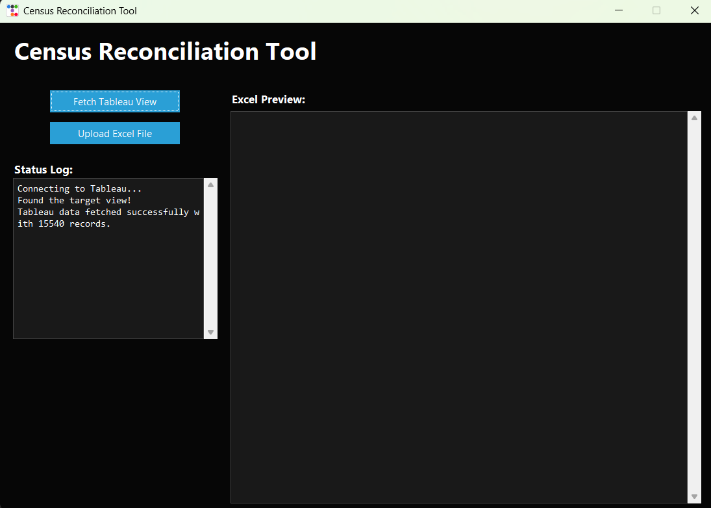

# Tableau Census Reconciliation Tool

This internal-use Python app reconciles hospital Excel records with Tableau census data. It connects to a Tableau view, pulls patient charge codes, and automatically applies reconciliation rules to uploaded Excel files—identifying billed, unbilled, LWBS, and AMA cases.

---

*Note: The screenshot displays sample data only. Actual patient information has been omitted to ensure privacy and comply with data protection regulations.*
---

## 📌 What It Does

- Connects to a Tableau view to fetch patient charge codes
- Accepts Excel files exported from hospital systems
- Cleans and splits patient names for accurate matching
- Calculates patient encounter IDs (`ID1`, `ID2`, `ID3`)
- Applies charge code logic:
  - LWBS (Left Without Being Seen)
  - AMA (Against Medical Advice)
  - Billed and non-ED encounters
- Automatically updates `Status` to `DE_COMPLETE` when matched
- Saves a processed copy of the Excel file with results

---

## 💡 Key Features

- Desktop GUI with a modern dark theme
- Fetches Tableau data and previews Excel transformations
- Adds reconciliation columns automatically
- Smart patient name parsing and serial date calculations
- Option to open the cleaned file after processing
- Handles errors gracefully with detailed tracebacks

---

## 🛠 Tech Highlights

- **Python 3.9+**
- GUI: `ttkbootstrap`
- Data: `pandas`, `openpyxl`
- Tableau API: `tableauserverclient`
- Config support via `python-dotenv`
- Compatible with PyInstaller `.exe` builds

---

_Built to simplify reconciliation workflows and improve accuracy across finance and revenue cycle teams._
