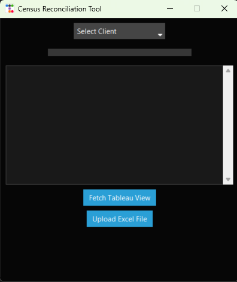
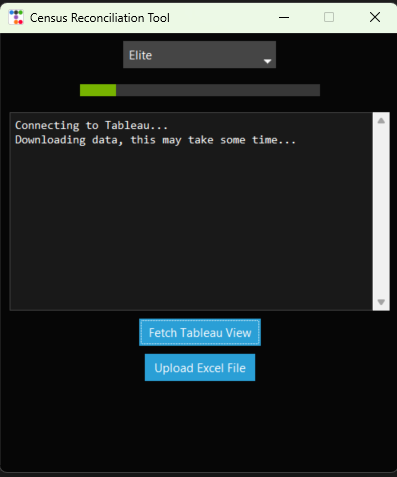
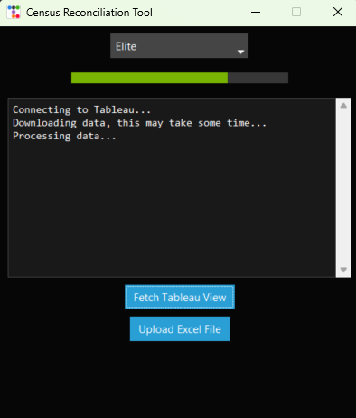
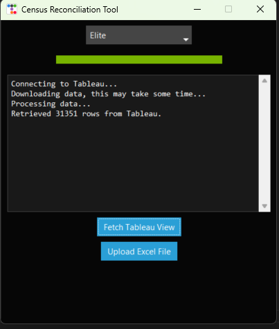
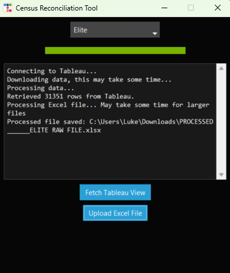

# Tableau Census Reconciliation Tool

This internal-use Python application streamlines reconciliation of hospital Excel records with Tableau census data. It connects securely to Tableau, fetches patient encounter details, and applies automated matching and validation rules to uploaded Excel files — generating a reconciled output with status flags, calculated IDs, and charge code evaluations.

---

## Screenshots

### Launch Screen  
The app's initial interface for starting the reconciliation workflow.  

### Tableau Connection  
Enter your license key to securely connect to Tableau.  

### Data Retrieval  
Once connected, patient encounter data is fetched from the Tableau view.  

### Data Ready  
Data successfully retrieved and available for reconciliation.  

### File Upload & Results  
Upload your hospital Excel file, then access the processed, reconciled output.  

---

## 📌 What It Does

- Connects to a Tableau view to fetch patient charge codes
- Accepts Excel files exported from hospital systems
- Cleans and splits patient names for accurate matching
- Calculates patient encounter IDs (`ID1`, `ID2`, `ID3`)
- Applies charge code logic:
  - LWBS (Left Without Being Seen)
  - AMA (Against Medical Advice)
  - Billed and non-ED encounters
- Automatically updates `Status` to `DE_COMPLETE` when matched
- Saves a processed copy of the Excel file with results

---

## 💡 Key Features

- Desktop GUI with a modern dark theme
- Fetches Tableau data and previews Excel transformations
- Adds reconciliation columns automatically
- Smart patient name parsing and serial date calculations
- Option to open the cleaned file after processing
- Handles errors gracefully with detailed tracebacks

---

## 🛠 Tech Highlights

- **Python 3.9+**
- GUI: `ttkbootstrap`
- Data: `pandas`, `openpyxl`
- Tableau API: `tableauserverclient`
- Config support via `python-dotenv`
- Compatible with PyInstaller `.exe` builds

---

_Built to simplify reconciliation workflows and improve accuracy across finance and revenue cycle teams._
