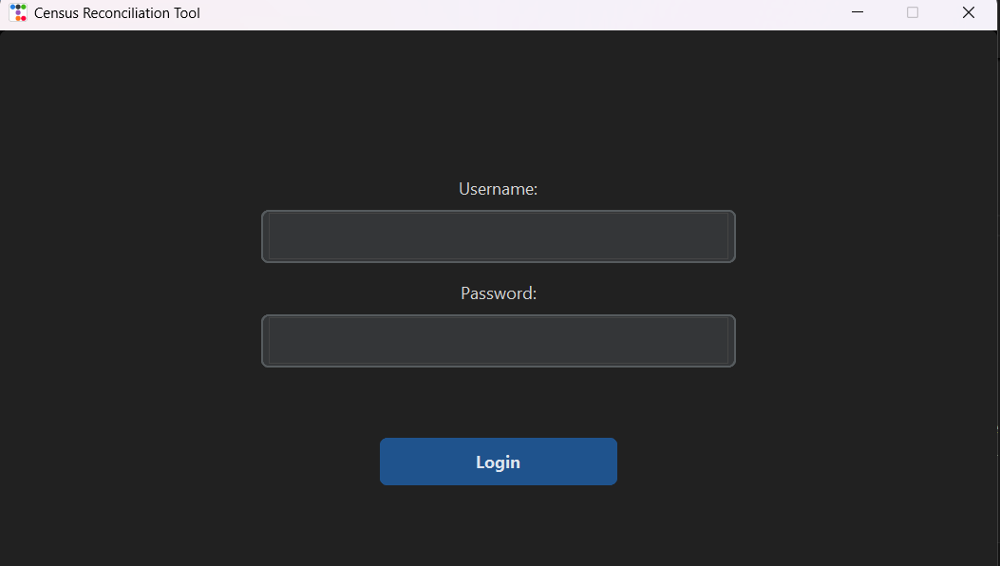
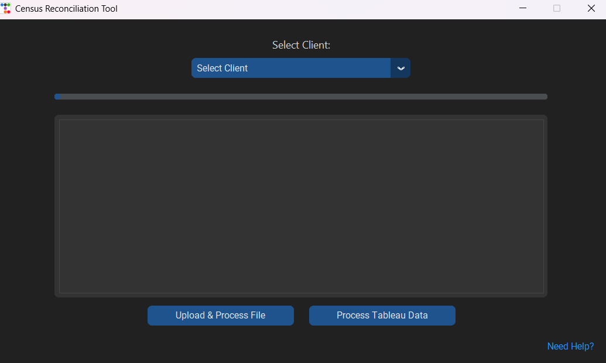
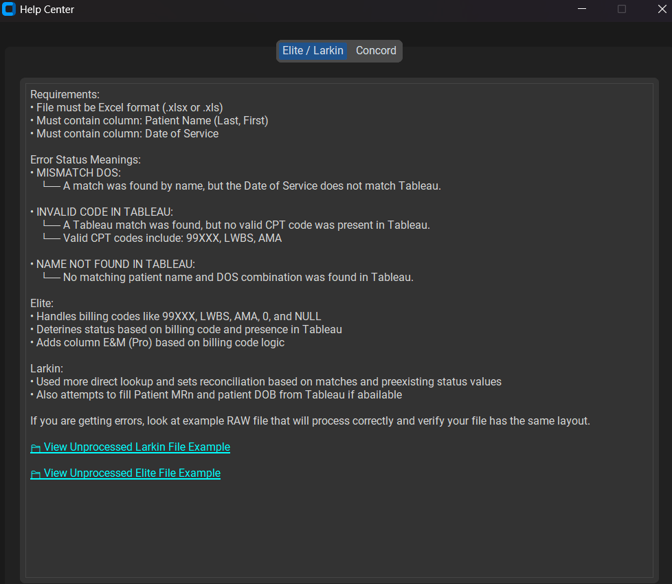
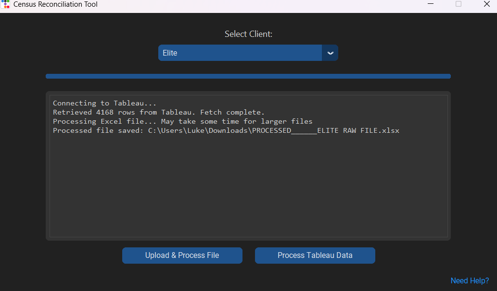

# Census Reconciliation Tool

This in-house Python application streamlines reconciliation of AdvancedMD records with Tableau census data. It connects securely to Tableau, fetches patient encounter details, and applies automated matching and validation rules to uploaded files, generating a reconciled output with status flags, calculated IDs, and Tableau-synced provider data.

## Table of Contents
- [What It Does](#what-it-does)
- [Key Features](#key-features)
- [Demo](#demo)
- [Tech Highlights](#tech-highlights)
- [Input File Requirements](#input-file-requirements)
- [Security & Compliance](#⚠️-note)

---

## What It Does

- Connects to Tableau Server securely using `tableauserverclient`
- Secure login with Tableau username/password credentials (no OAuth)
- Accepts `.xlsx`, `.xls`, and `.csv` files from AMD reports
- Identifies and matches patients by:
  - Last name, first name, and date of service
  - Or by medical record number (MRN)
- Fetches census data based on site (Elite, Larkin, Concord)
- Calculates patient encounter IDs (`ID1`, `ID2`, `ID3`)
- Applies status and reconciliation logic for:
  - LWBS (Left Without Being Seen)
  - AMA (Against Medical Advice)
  - Invalid or missing codes
  - Name not found
- Auto-fills Tableau values: Provider, Carrier, Facility
- Saves a processed Excel file with detailed results

---

## Key Features

- Desktop GUI with dark mode using `CustomTkinter` + `ttkbootstrap`
- Built-in client selector and login system
- Animated loading spinner and progress bar
- Auto-generates IDs and status columns
- Help Center with usage instructions and sample file links
- Graceful error handling with traceback logging
- Opens processed file directly after confirmation

---

## Demo

| **Login Screen**                                  | **Main Dashboard**                               |
|:-------------------------------------------------:|:------------------------------------------------:|
|  |  |

| **Help Center**                                   | **Processed Output**                             |
|:-------------------------------------------------:|:------------------------------------------------:|
|   |  |

---

## Tech Highlights

- **Python 3.10+**
- GUI: `CustomTkinter`, `ttkbootstrap`
- Data handling: `pandas`, `openpyxl`
- Tableau API: `tableauserverclient`
- Image handling: `Pillow`
- Multi-threaded processing via `threading`
- Windows-compatible with PyInstaller `.exe` support

---

## Input File Requirements

### Elite / Larkin
- Excel format: `.xlsx` or `.xls`
- Required columns:
  - `Patient Name (Last, First)`
  - `Date of Service`

### Concord
- File format: `.xlsx`, `.xls`, or `.csv`
- Required columns:
  - `Patient Name`
  - `Date of Service`
  - `Account Number`
  - `Medical Record Number`

---

## ⚠️ Note
- Internal Use Only!
- This tool is intended solely for authorized staff at Blitz Medical Billing. 
- Do **not** distribute or use this application outside approved environments.

## 🔐 Security & Compliance

This application is designed to process healthcare data (e.g., names, MRNs, dates of service), but no PHI is committed to or stored in this repository.

- No patient data is hardcoded or bundled.
- All uploads happen locally on the user's machine.
- Temporary and output files are not uploaded or retained externally.
- Users are responsible for ensuring HIPAA compliance when operating this tool in a production environment.

This repository contains logic only and is safe for internal, private use.